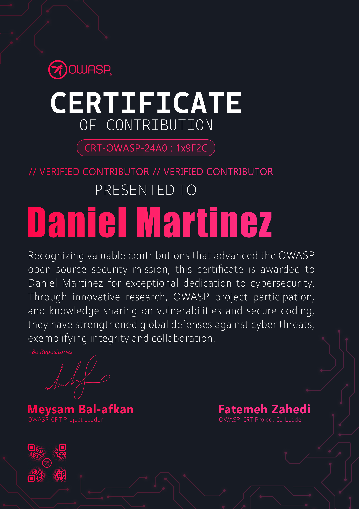
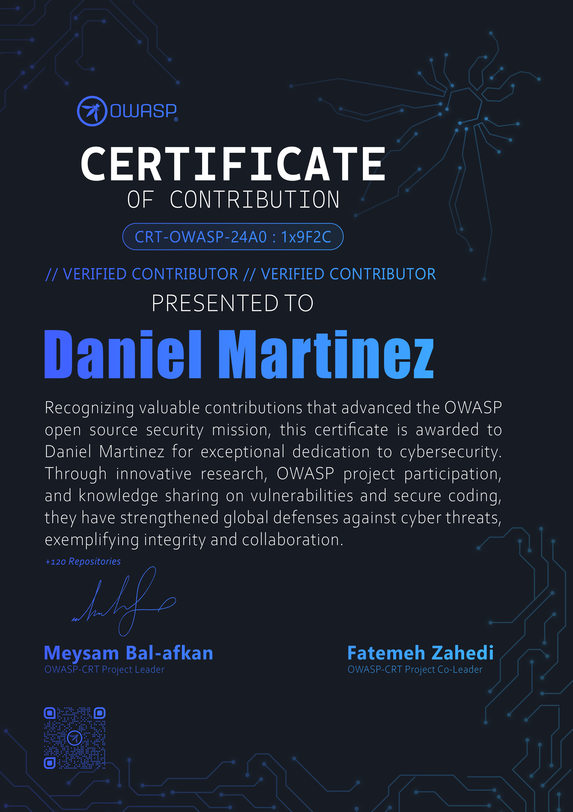
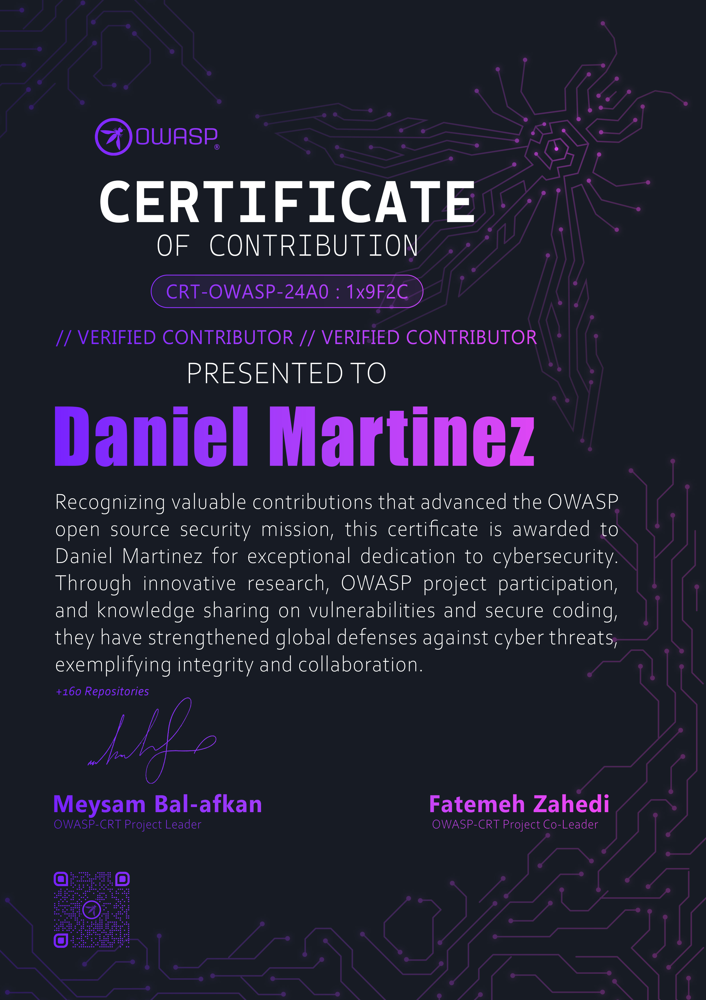

# OWASP Community Recognition Tool

An automated tool to generate verifiable credentials for valued OWASP contributors. This project is currently in its early stages.

---

### Project Status

This project is currently in the Inception phase, but moving quickly. The core concepts and visual designs for the certificates have been finalized. We are now actively working on the template integration and the backend automation workflow. We welcome community feedback, ideas, and contributions during this active development stage.

### About The Project

The OWASP Foundation thrives on the dedication of its global community of volunteers. From code contributions and documentation to chapter leadership and event organization, these efforts are the backbone of our mission.

The **OWASP Community Recognition Tool** aims to create a streamlined, transparent, and automated system to formally acknowledge these valuable contributions. By providing verifiable credentials, we want to empower our members to showcase their commitment and expertise.

### Key Objectives

- **Automate:** To eliminate manual processes for issuing contribution certificates.
- **Verify:** To provide a clear, verifiable link between a credential and the contributions it represents.
- **Standardize:** To create a consistent and fair process for recognizing community efforts.
- **Empower:** To give contributors a tangible and shareable acknowledgment of their work.

### How It Works (Core Concept)

The tool will integrate directly with GitHub to create a seamless and automated experience. The core idea is to leverage GitHub's infrastructure (like web forms, Issues, and Actions) to:

1. **Receive requests** from community members.
2. **Automatically verify** their contributions based on predefined criteria.
3. **Generate and issue** a unique and publicly verifiable credential upon successful validation.

The exact technical implementation will be defined and refined as the project progresses, with a primary focus on simplicity, security, and user experience.

### Certificate Tiers

To recognize different levels of commitment, we issue three distinct tiers of certificates:

| Tier 1 (Bronze) | Tier 2 (Silver) | Tier 3 (Gold) |
| :---: | :---: | :---: |
|  |  |  |

> **For Developers:** See the **[Certificate Design Specifications](assets/DESIGNSPEC.md)** for detailed dimensions, fonts, and color assets used in these templates.

### How to Contribute

Your contributions are essential to making this project a success! We are looking for help in various areas, including:
* **Feedback & Ideas:** Share your thoughts on the proposed workflow and features.
* **Development:** Help us build the tool! We currently need assistance with core generation workflow and setting up GitHub Actions for automation.
* **Documentation:** Improve this README and create user guides.
* **Testing:** Help us test the workflow once the MVP is available.

For detailed instructions on how to get started, the standard workflow, and how to submit a Pull Request, please read our **[CONTRIBUTING.md](CONTRIBUTING.md)** guidelines.

### Project Leaders

- [Meysam Bal-afkan](http://github.com/galaxy-sc)
- [Fatemeh Zahedi](https://github.com/dylanzahedi)

### Design Lead

- [Hamidreza Abedi nasab](https://github.com/Ham1dRz) 
