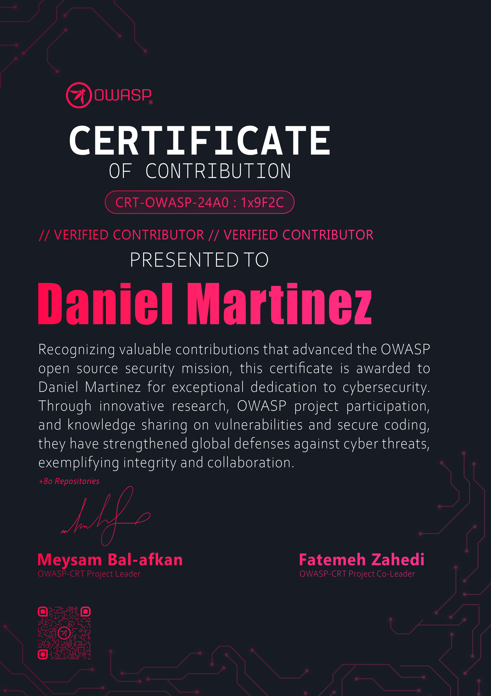
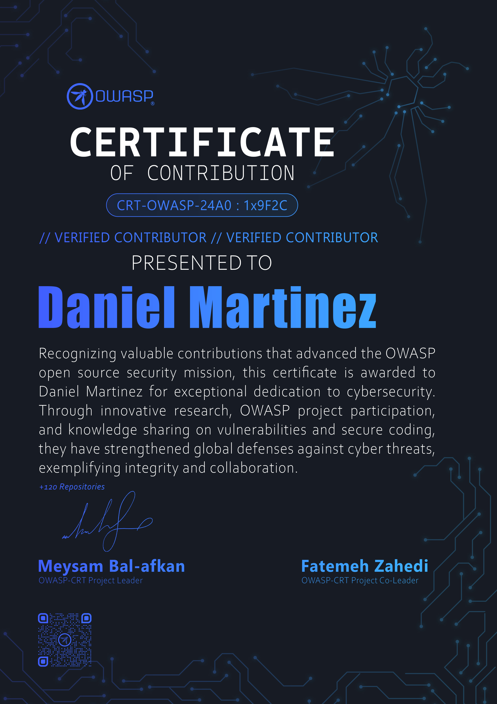
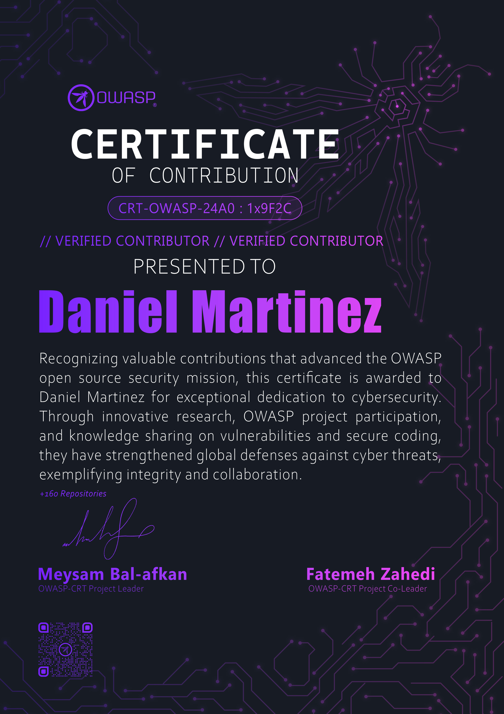

# OWASP Community Recognition Tool
[](https://owasp.org/projects/)
[](LICENSE)
[](https://crt.owasp.org)

An automated tool that verifies GitHub contributions and issues verifiable, tier-based credentials to valued OWASP community members.

---

### Project Status

**The tool is built and live — it's now in beta, being tested and validated in the real world.**

Both halves of the pipeline are complete and deployed:

- **Backend:** A seamless pipeline consisting of a Cloudflare Worker for edge validation and a GitHub Actions workflow that verifies contributions and issues certificates automatically.
- **Frontend:** A web app where contributors securely authenticate via GitHub to request their credential, then view, download, and share the issued certificate, deployed at **[crt.owasp.org](https://crt.owasp.org)**.

Development continues, but the focus has shifted from building core features to proving the tool holds up under real usage: catching edge cases, confirming tier scoring is fair across different contribution patterns, and hardening the workflow against abuse. If you request a certificate and hit something odd, please open an issue — beta feedback is exactly what we need right now.

### See it in Action

Watch a quick demonstration of the seamless certificate request process:

<div align="center">
  <video src="https://github.com/user-attachments/assets/96c693f2-f3dd-42f8-8274-6850a1208686" width="100%" max-width="800px" controls="controls"></video>
</div>

### About The Project

The OWASP Foundation thrives on the dedication of its global community of volunteers. From code contributions and documentation to chapter leadership and event organization, these efforts are the backbone of our mission.

The **OWASP Community Recognition Tool** aims to create a streamlined, transparent, and automated system to formally acknowledge these valuable contributions. By providing verifiable credentials, we want to empower our members to showcase their commitment and expertise.

### Key Objectives

- **Automate:** To eliminate manual processes for issuing contribution certificates.
- **Verify:** To provide a clear, verifiable link between a credential and the contributions it represents.
- **Standardize:** To create a consistent and fair process for recognizing community efforts.
- **Empower:** To give contributors a tangible and shareable acknowledgment of their work.

### How It Works
 
The tool leverages a serverless architecture using Cloudflare Workers and GitHub Actions:
 
1. **Authenticate:** A contributor visits **[crt.owasp.org](https://crt.owasp.org)** and authenticates via the official GitHub OAuth application. This ensures the request is definitively linked to their GitHub identity without any manual form filling.
2. **Edge Validation:** A Cloudflare Worker at the edge intercepts the request, verifies the secure session, and enforces a strict 24-hour rate limit to protect the backend infrastructure from spam and abuse.
3. **Analyze & Score:** Once validated, a GitHub Action triggers automatically. It uses the GitHub GraphQL API to scan the requester's direct commits and merged/co-authored pull requests across public OWASP repositories. Contributions are weighted (lines added, lines removed, commit count), normalized, and checked against dynamically derived thresholds to assign a **Gold**, **Silver**, or **Bronze** tier.
4. **Issue:** The resulting verified data is committed to a dedicated `data` branch. The contributor's certificate is instantly generated and made available to view, download, or share via a persistent link (e.g., `crt.owasp.org/?id=...`).

For the full scoring methodology and how to run the pipeline locally, see the **[Algorithm & Contribution Analytics documentation](algorithm/README.md)**.

### Privacy & Data Transparency

To maintain the integrity and verifiability of the issued certificates, the system automatically commits your **First Name**, **Last Name**, **GitHub Username**, and contribution statistics to the `data` branch of this repository. 

Please note that this is a **public repository**, meaning this information will become publicly accessible as a transparent record of your certification. By authenticating and requesting a credential via the tool, you acknowledge and consent to this public storage.

### Certificate Tiers

To recognize different levels of commitment, we issue three distinct tiers of certificates:

| Tier 1 (Bronze) | Tier 2 (Silver) | Tier 3 (Gold) |
| :---: | :---: | :---: |
|  |  |  |

> **For Developers:** See the **[Certificate Design Specifications](assets/DESIGNSPEC.md)** for detailed dimensions, fonts, and color assets used in these templates.

### Repository Structure

```text
OWASP-CRT/
├── .github/workflows/     # The certificate-issuing GitHub Action
├── worker/                # Cloudflare Worker script for OAuth & Edge Validation
├── algorithm/             # Python scoring engine & contribution analytics (see its README)
├── frontend/              # React/Vite web app for viewing certificates (see its README)
├── assets/                # Certificate templates, logos, and design assets
├── CONTRIBUTING.md
└── LICENSE
```

- **[algorithm/README.md](algorithm/README.md)** — data pipeline, scoring methodology, and local setup instructions.
- **[frontend/README.md](frontend/README.md)** — frontend architecture, stack, and local development instructions.

### How to Contribute

The tool is live, so the most valuable thing you can do right now is **use it and try to break it**. We're looking for help in these areas:
* **Testing:** Request a certificate, try edge cases (multiple repos, co-authored commits, low/high activity), and report anything that looks wrong via an Issue.
* **Development:** Help us fix bugs found during testing, harden the GitHub Actions workflow against abuse, and improve the scoring engine.
* **Feedback & Ideas:** Tell us whether tier assignments feel fair, and suggest improvements to the workflow.
* **Documentation:** Improve this README, the module-level docs, and user guides.

For detailed instructions on how to get started, the standard workflow, and how to submit a Pull Request, please read our **[CONTRIBUTING.md](CONTRIBUTING.md)** guidelines.

### Project Leaders

- [Meysam Bal-afkan](http://github.com/galaxy-sc)
- [Fatemeh Zahedi](https://github.com/dylanzahedi)

### Design Lead

- [Hamidreza Abedi nasab](https://github.com/Ham1dRz)
